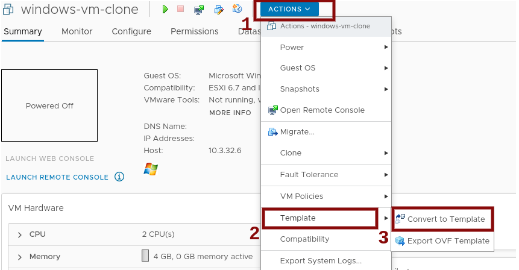

# Creating the vSphere Windows VM Golden Image

This guide describes the thought process of creating a Windows virtual machine base image (the Golden Image) in vSphere.

## 1. Select a compatible Windows Server version

Currently, the Windows Machine Config Operator (WMCO) stable version supports:
* Windows Server 2022 Long-Term Servicing Channel (must contain the OS-level container networking patch [KB5012637](https://support.microsoft.com/en-us/topic/april-25-2022-kb5012637-os-build-20348-681-preview-2233d69c-d4a5-4be9-8c24-04a450861a8d))
* Windows Server 20H2 Semi-Annual Channel

*Please note that Windows Server 2019 is unsupported, as patch [KB4565351](https://support.microsoft.com/en-us/help/4565351/windows-10-update-kb4565351)
is not included. This is a requirement of the [hybrid OVN Kubernetes networking with a custom VXLAN port](setup-hybrid-OVNKubernetes-cluster.md#vSphere) feature.*

## 2. Create the virtual machine

To start with, create a new virtual machine in vSphere from the selected Windows Server distribution using the ISO image.
See [vSphere documentation](https://docs.vmware.com/en/VMware-vSphere/index.html) for installation guidelines.
Ensure that the [virtual hardware version](https://kb.vmware.com/s/article/1003746) meets the
[OpenShift infrastructure requirements](https://docs.openshift.com/container-platform/latest/installing/installing_vsphere/preparing-to-install-on-vsphere.html#installation-vsphere-infrastructure_preparing-to-install-on-vsphere).

### Setup VMware Tools

Install VMware Tools version 11.0.6 or greater. See the [VMware Tools documentation](https://docs.vmware.com/en/VMware-Tools/index.html) for more information.

Ensure the *VMware Tools* Windows service is running and will start on boot, You can query the `VMTools` service by 
running the following PowerShell command:

```powershell
    Get-Service -Name VMTools | Select Status, StartType 
```

Ensure the VMware Tools configuration file `tools.conf` is present in the following location:

```
    C:\ProgramData\VMware\VMware Tools\tools.conf
```

In case the configuration file does not exist, VMware Tools installs an example configuration file in the same 
directory as the location above, or you can download it from the
[open-vm-tools](https://raw.githubusercontent.com/vmware/open-vm-tools/master/open-vm-tools/tools.conf) repository.

#### Disable the network interface exclusion

Uncomment the `exclude-nics` option in the `tools.conf` file and clear any existing values, the value must be 
empty (no value), to ensure that any vNIC generated on the Windows VM by the hybrid-overlay won't be excluded,
allowing VMware Tools to report the IP addresses in vCenter.

```bash
    exclude-nics=
``` 

Alternatively, you can run the provided PowerShell script [configure-vm-tools.ps1](vsphere_ci/scripts/configure-vm-tools.ps1) 
that downloads the example configuration file, disables the network interface exclusion and creates the `tools.conf` 
file in the expected location.

Ensure the virtual machine has a valid IP address in vCenter. Refer to the *IP Addresses* section in the *Summary* tab
of the vSphere Web Client or run the `ipconfig` command in the Windows VM.

## 3. Set up SSH

Install and configure the OpenSSH Server on the Windows virtual machine with automatic startup and key based-authentication.
See [Microsoft documentation](https://docs.microsoft.com/en-us/windows-server/administration/openssh/openssh_install_firstuse)
to install using PowerShell. Given we are setting up SSH access for an administrator, please follow the
[Microsoft documentation](https://docs.microsoft.com/en-us/windows-server/administration/openssh/openssh_keymanagement#administrative-user)
to deploy the public key. This public key must corresspond to private key present in the [secret](../README.md#create-a-private-key-secret).

Alternatively, you can use the PowerShell script [install-openssh.ps1](vsphere_ci/scripts/install-openssh.ps1) to programmatically 
install and configure the OpenSSH Server:

```powershell
    ./install-openssh.ps1 <path/to/public_key_file>
```

where, `<path/to/public_key_file>` is the path to the public key file corresponding to the private key.

Ensure the SSH service is running and that it will start on boot by running the following PowerShell command:

```powershell
    Get-Service -Name "ssh*" | Select Name, Status, StartType 
```

where, both installed services *ssh-agent* and *sshd* must have status *Running* and start type *Automatic*.

Ensure the OpenSSH Server installation successfully created an inbound firewall rule enabling access to the above 
service (sshd) by running the following PowerShell command:

```powershell
    Get-NetFirewallRule -DisplayName "*ssh*"
```

In case no firewall rule exist, you must create it by running the following PowerShell command:

```powershell
    New-NetFirewallRule -DisplayName 'OpenSSH Server (sshd)' -LocalPort 22 -Enabled True -Direction Inbound -Protocol TCP -Action Allow 
```

## 4. Set up incoming connection for container logs

Create a new firewall rule in the Windows VM to allow incoming connections for container logs, usually 
on TCP port `10250` by running the following PowerShell command:

```powershell
    New-NetFirewallRule -DisplayName "ContainerLogsPort" -LocalPort 10250 -Enabled True -Direction Inbound -Protocol TCP -Action Allow -EdgeTraversalPolicy Allow
```

## 5. Install OS-level container networking patch KB5012637 

Download the patch files from the [Microsoft Update Catalog](https://www.catalog.update.microsoft.com/Search.aspx?q=KB5012637).
Then, install the patch. Windows Command Prompt example:
* `wusa.exe C:\PATH-TO-UPDATE\windows10.0-kb5012637-x64.msu /quiet /norestart`

Alternatively, you can use the PowerShell script [install-kb5012637.ps1](vsphere_ci/scripts/install-kb5012637.ps1) to 
programmatically download and install the required patch:

```powershell
    ./install-kb5012637.ps1
```

## 6. Generalize the virtual machine installation

To deploy the Windows VM as a reusable image, you have to first generalize the VM removing computer-specific information 
such as installed drivers. Running the `sysprep` command with a *unattend* answer file generalizes the image and 
makes it ready for future deployments, maintaining all the changes needed for the WMCO installation. 

A reference [unattend.xml](unattend.xml) file is provided; it **cannot** be used directly. You must customize it
replacing the `MyPassword` placeholder with the desired password for the Administrator account; it prevents the built-in
Administrator account from having a blank password by default. It's recommended to follow the [Microsoft best 
practices for choosing the password.](https://docs.microsoft.com/en-us/windows/security/threat-protection/security-policy-settings/password-must-meet-complexity-requirements)

Please note that, the `ComputerName` value in the [unattend.xml](unattend.xml) file must follow the
[Kubernetes' names specification](https://kubernetes.io/docs/concepts/overview/working-with-objects/names). The latter,
also applies to Guest OS customization performed on the resulting template while creating new VMs.

Before executing the `sysprep` command, clone the VM and then run `sysprep` command in the cloned VM. To execute
the `sysprep` command use:

```cmd
    C:\Windows\System32\Sysprep\sysprep.exe /generalize /oobe /shutdown /unattend:<path/to/unattend.xml>
```

where `<path/to/unattend.xml>` is the path to the customized answer file.

Note: There is [a limit](https://docs.microsoft.com/en-us/windows-hardware/manufacture/desktop/sysprep--generalize--a-windows-installation#limits-on-how-many-times-you-can-run-sysprep)
on how many times you can run the `sysprep` command.

## 7. Set up the virtual machine template

Once the `sysprep` command completes the Windows virtual machine will power off. 

You **must not** use or power on this virtual machine anymore.

Next, you need to convert this virtual machine, in Power-Off status, to a Template as shown in Figure 1.

||
|:---|
|Figure 1. Steps to convert a VM to Template in vCenter|

## 8. Using the virtual machine template

In order to use the recently created template, enter the template name in the [machineset](../README.md#configuring-windows-instances-provisioned-through-machinesets).

```yaml
    apiVersion: machine.openshift.io/v1beta1
    kind: MachineSet
    spec:
      template:
        spec:
          providerSpec:
            template: <Windows Virtual Machine Template Name>
```

## Supporting information

* https://docs.microsoft.com/en-us/windows/release-health/release-information
* https://docs.microsoft.com/en-us/windows-server/get-started/windows-server-release-info
* https://docs.microsoft.com/en-us/windows-server/get-started-19/servicing-channels-19
